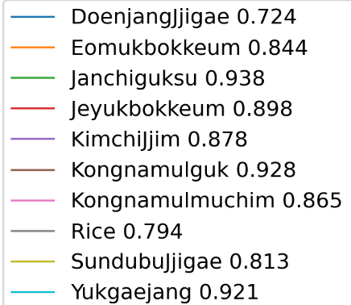
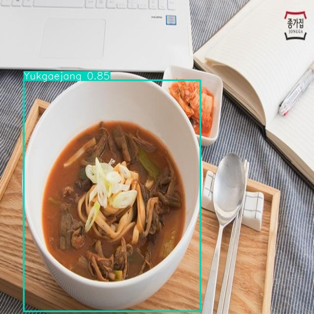

# What the Food
## Task 1 - Detect foods from image

### Backbone model
- YOLO v8을 이용해서 fine-tuning 진행

### Dataset
- [AI Hub 한국 이미지(음식)](https://www.aihub.or.kr/aihubdata/data/view.do?currMenu=115&topMenu=100&aihubDataSe=data&dataSetSn=79)의 10개의 class, 10000장의 image

### Annotation

- Dataset의 bounding box의 상태가 좋지 않아 human annotation 진행

## Task 2 - Propose food intake
### Get daily nutrient intake

- 이용자의 키, 몸무게, 나이, 성별을 이용해서 하루 칼로리 권장 섭취량 측정
- 한국인 기준 단백질, 지방, 탄수화물, 당류, 나트륨 권장 섭취량

### Get nutrient of foods
- 어딜 참고해서 정보 받음

### Propose food intake
- 음식별 영양소와 개인별 영양소 권장 섭취량을 이용해서 음식별 섭취량을 추천
- 최적화 알고리즘을 이용해서 추천 섭취량을 계산

## 실행 방법
- 필요한 패키지를 설치
- 디렉토리 안에 먹은 이미지 파일 올리기

- 터미널에 다음을 입력하세요.

        python main.py

